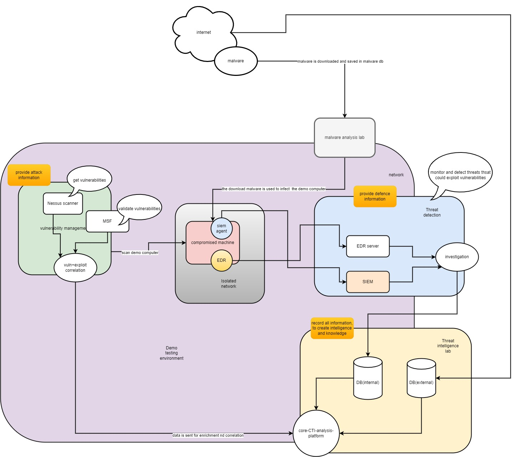

# Security Infrastructure Overview

## Table of Contents

1. [Introduction](#introduction)
    - Overview
    - Importance of Security Infrastructure
2. [Internet and Malware Analysis](#internet-and-malware-analysis)
    - Source of Malware
    - Malware Analysis Lab
3. [Vulnerability Management](#vulnerability-management)
    - Nessus Scanner
    - Metasploit Framework (MSF)
    - Vulnerability-Exploit Correlation
4. [Demo Testing Environment](#demo-testing-environment)
    - Compromised Machine
    - SIEM Agent
    - Endpoint Detection and Response (EDR)
5. [Threat Detection](#threat-detection)
    - EDR Server
    - Security Information and Event Management (SIEM)
    - Investigation Process
6. [Threat Intelligence Lab](#threat-intelligence-lab)
    - Core CTI Analysis Platform
    - Databases (Internal and External)
    - Creating Intelligence and Knowledge
7. [Information Flow](#information-flow)
    - Provide Attack Information
    - Provide Defense Information
    - Record and Analyze Information
8. [Conclusion](#conclusion)
    - Summary
    - Future Enhancements

## Introduction

### Overview
In today’s digital landscape, cybersecurity is of paramount importance. Organizations must constantly analyze and improve their security infrastructure to defend against increasingly sophisticated cyber threats. This article provides a detailed overview of a comprehensive security infrastructure, encompassing malware analysis, vulnerability management, threat detection, and threat intelligence.

### Importance of Security Infrastructure
A robust security infrastructure is essential for identifying vulnerabilities, detecting and responding to threats, and generating actionable intelligence. This ensures that organizations can preemptively address potential security issues and respond effectively to incidents.

## Internet and Malware Analysis

### Source of Malware
Malware, or malicious software, originates from various sources on the internet. Cybercriminals use it to exploit vulnerabilities in systems, causing data breaches, service disruptions, and financial losses.

### Malware Analysis Lab
A dedicated Malware Analysis Lab is essential for understanding the behavior and impact of malware. In this lab, downloaded malware is analyzed and stored in a database for future reference. This step is crucial for developing effective countermeasures.

## Vulnerability Management

### Nessus Scanner
The Nessus Scanner is a powerful tool used to identify vulnerabilities within a system. It scans the network for known vulnerabilities and provides detailed reports, helping security teams prioritize their remediation efforts.

### Metasploit Framework (MSF)
The Metasploit Framework is a versatile tool used to validate identified vulnerabilities. It allows security professionals to simulate attacks and confirm whether the vulnerabilities can be exploited, thereby assessing the risk level more accurately.

### Vulnerability-Exploit Correlation
This process involves correlating identified vulnerabilities with known exploits. By understanding which exploits can target specific vulnerabilities, security teams can better prepare their defenses and mitigate potential threats.

## Demo Testing Environment

### Compromised Machine
In a controlled demo testing environment, a machine is intentionally compromised using known malware. This allows security teams to observe the behavior of the malware and the system’s response in a safe setting.

### SIEM Agent
A Security Information and Event Management (SIEM) agent is deployed on the compromised machine to collect and send data to the central SIEM system. This data includes logs and alerts, which are critical for threat detection and analysis.

### Endpoint Detection and Response (EDR)
EDR solutions monitor and respond to threats at the endpoint level. In the demo environment, EDR tools are used to detect malicious activities on the compromised machine and take appropriate action to contain the threat.

## Threat Detection

### EDR Server
The EDR server collects data from endpoint agents, analyzes it for signs of malicious activity, and generates alerts. It plays a crucial role in the early detection of threats, allowing for prompt investigation and response.

### Security Information and Event Management (SIEM)
SIEM systems aggregate and analyze data from various sources, including network devices, servers, and applications. By correlating this data, SIEM systems can detect complex attack patterns and provide comprehensive threat visibility.

### Investigation Process
When a threat is detected, a detailed investigation process is initiated. This involves analyzing logs, identifying the source of the threat, and determining the extent of the compromise. The findings are used to inform remediation efforts and prevent future incidents.

## Threat Intelligence Lab

### Core CTI Analysis Platform
The Core Cyber Threat Intelligence (CTI) Analysis Platform is the heart of the Threat Intelligence Lab. It aggregates data from various sources, including internal and external databases, and analyzes it to generate actionable intelligence.

### Databases (Internal and External)
Internal and external databases store vast amounts of threat intelligence data. Internal databases contain proprietary information, while external databases provide access to community-shared threat intelligence. Together, they offer a comprehensive view of the threat landscape.

### Creating Intelligence and Knowledge
The analysis platform records all information to create a knowledge base. This includes details on identified threats, vulnerabilities, exploits, and mitigation strategies. By continuously updating this knowledge base, organizations can stay ahead of emerging threats.

## Information Flow

### Provide Attack Information
The process begins with identifying and validating vulnerabilities. Tools like the Nessus Scanner and Metasploit Framework play a crucial role in this stage, providing detailed attack information that informs the security posture.

### Provide Defense Information
Defense information is derived from monitoring and analyzing data collected by EDR and SIEM systems. This information helps in detecting potential threats and initiating appropriate response measures.

### Record and Analyze Information
All collected data is sent to the Threat Intelligence Lab for enrichment and correlation. By recording and analyzing this information, the lab generates actionable intelligence that can be used to enhance the overall security infrastructure.

## Conclusion

### Summary
This article outlined a comprehensive security infrastructure, detailing the roles of various components, including malware analysis, vulnerability management, threat detection, and threat intelligence. Each element is interconnected, forming a cohesive system that continuously improves the organization’s security posture.

### Future Enhancements
As cyber threats evolve, so too must the security infrastructure. Future enhancements may include integrating advanced AI and machine learning techniques for more sophisticated threat detection and response, as well as expanding the scope of threat intelligence gathering and analysis. By staying proactive and adaptive, organizations can effectively defend against emerging cyber threats.
